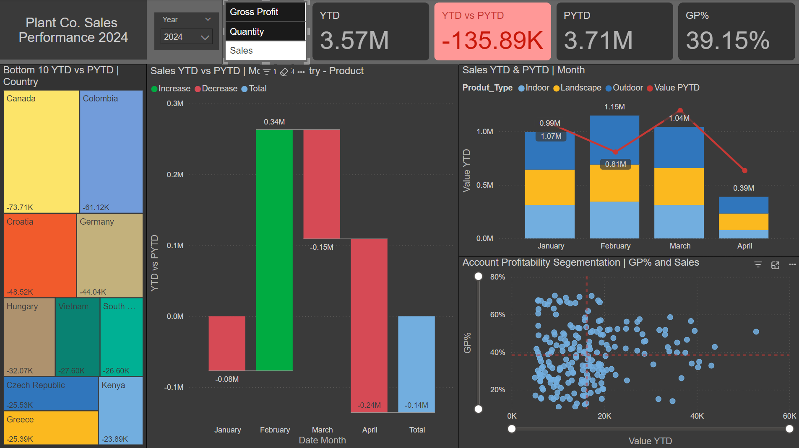

# PlantCo-Performance-Dashboard

## Overview

This project demonstrates the use of **Power BI** to build a dynamic and insightful performance report for a made-up company. The report tracks key metrics like **Sales, Quantity, and Gross Profit**, offering comparisons across **different years, countries, product types**, and **time periods (month, quarter)**. The dashboard utilizes **switch measures, virtual tables**, and **conditional formatting** to allow users to explore data interactively and identify trends.

## Table of Contents

1. [Data Source](#data-source)
2. [Data Modeling](#data-modeling)
3. [Report Features](#report-features)
4. [Visualizations](#visualizations)
5. [How to Use](#how-to-use)
6. [Conclusion](#conclusion)

## Data Source

The data for this report was sourced from an **Excel file** and imported into **Power Query**. Power Query was used to:

- Clean and transform the raw data.
- Create **virtual tables** to enable more flexible calculations.
- Load the transformed data into Power BI for report modeling.

📄 **Excel Source:** [Plant_DTS.xls](assets/Plant_DTS.xls)

## Data Modeling

- **DAX Measures:** Custom measures such as **Sales YTD**, **Quantity YTD**, **Gross Profit %,** and **Previous Year comparisons (PYTD)** were built to drive insights.
- **Calculated Columns:** Additional columns were added where necessary to support analysis.
- **Switch Measures:** Implemented to allow users to switch between **Sales, Quantity, and Gross Profit** views throughout the report.

## Report Features

1. **Year Selection Slicer:**  
   Allows users to select between **2023 and 2024** for performance comparisons against the previous year.

2. **Metric Selection Slicer:**  
   A switch measure that lets users toggle between **Sales, Quantity**, and **Gross Profit** to view specific metrics across all visuals.

3. **KPI Cards:**
   - **YTD:** Displays the current **Year-to-Date (YTD)** value for the selected metric.
   - **PYTD:** Shows the **Previous Year-to-Date (PYTD)** value.
   - **YTD vs PYTD:** Highlights the change or variance between YTD and PYTD.
   - **GP %:** Displays the **Gross Profit Percentage**.

## Visualizations

1. **Treemap (Bottom 10 Countries YTD vs PYTD):**

   - Displays the **10 worst-performing countries** based on the selected metric (Sales, Quantity, or Gross Profit).
   - Helps users quickly identify areas that need attention.

2. **Waterfall Chart (YTD vs PYTD by Month):**

   - Provides a **month-by-month** comparison for the selected metric (e.g., sales).
   - Allows users to **drill down** to more granular levels (country, product type, product name).

3. **Line and Stacked Column Chart (Sales and PYTD):**

   - **X-Axis:** Time period (quarter or month).
   - **Y-Axis (Column):** Displays the YTD value for the selected metric.
   - **Y-Axis (Line):** Displays the PYTD value for the selected metric.
   - **Legend:** Segments data by **product types**.

4. **Scatter Plot (Account Profitability Segmentation):**
   - **X-Axis:** YTD value of the selected metric.
   - **Y-Axis:** Gross Profit Percentage (GP%).
   - The scatter plot helps segment accounts based on profitability and performance.

## How to Use

1. Open the **Power BI Dashboard**.
2. Use the **Year slicer** to switch between **2023 and 2024** performance comparisons.
3. Use the **Metric slicer** to toggle between **Sales, Quantity, and Gross Profit**.
4. Explore the **KPI Cards** for quick insights into overall performance.
5. Drill down within the **Waterfall** and **Stacked Column Charts** for more detailed insights.
6. Use the **Scatter Plot** to identify high-performing accounts or those needing improvement.

## Conclusion

This Power BI dashboard demonstrates the effective use of:

- **Power Query** for data preparation and virtual tables.
- **DAX measures** for custom calculations and dynamic insights.
- **Conditional formatting** to highlight trends and improve report readability.

By offering a clear and interactive view of **Sales, Quantity, and Gross Profit**, this dashboard empowers users to make data-driven decisions and address performance issues proactively.
